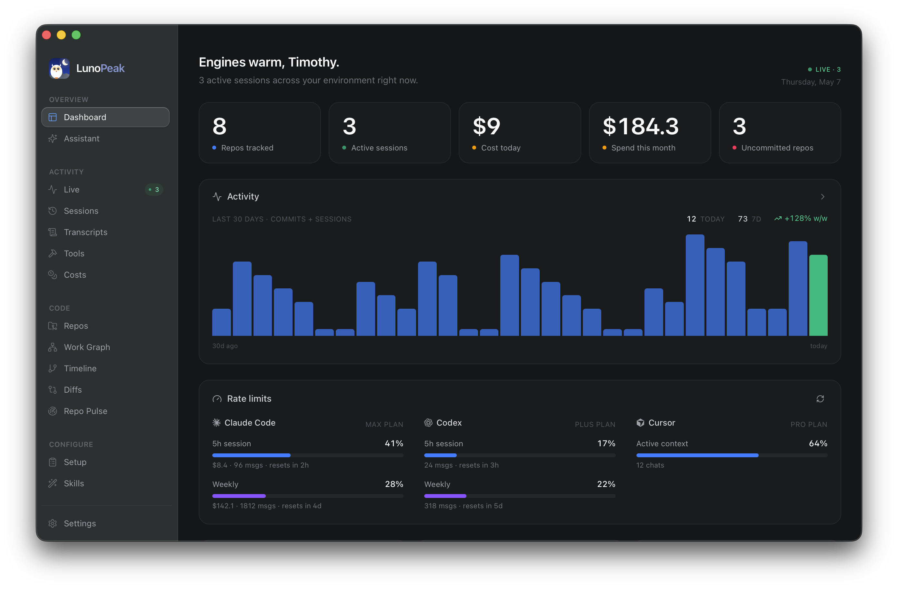
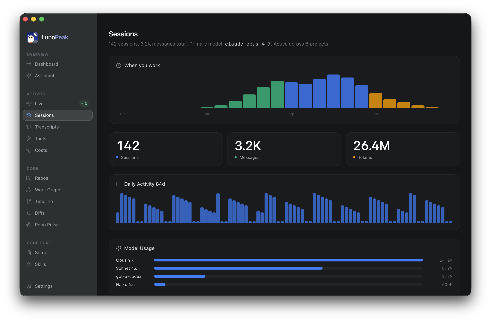
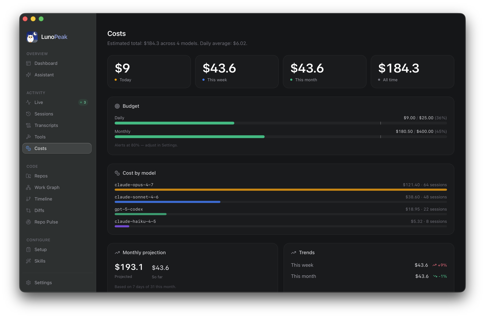
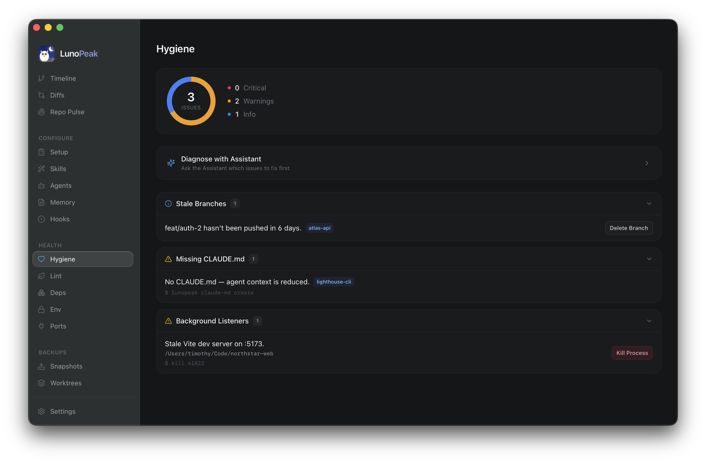

  

# LunoPeak

LunoPeak is a local-first, cross-platform desktop dashboard that gives you a real-time, unified view of your AI-assisted development environment. One window for every repo, session, agent, and config — covering Claude Code, Codex, and Cursor. No account, no cloud sync, no telemetry.

## Download

[**Download Latest Release**](https://github.com/idevtim/lunopeak/releases/latest)

- **macOS** - Apple Silicon & Intel (fully automatic updates)
- **Windows** - x64 & ARM64 (fully automatic updates)
- **Linux**:
  - **AppImage** - Fully automatic updates (recommended)
  - **DEB Package** - Semi-automatic updates (requires password)
  - **RPM Package** - Manual updates via GitHub

## What's New in 1.3.0

- **Cursor is now a first-class agent** alongside Claude Code and Codex — it shows up in Settings → Agents (on by default), the Live view (with workspace cwd, last bubble preview, and the real Cursor app icon), and as its own Setup card surfacing install path, project count, rule count, and merged MCP servers from `~/.cursor/mcp.json`.
- **Codex stays on, for real.** A one-shot first-run migration force-enables every known agent once and writes a sentinel so older settings files no longer carry a stale `codex: false` forward. Existing toggles you set later are sticky.
- **Symmetric agent fallbacks** — `claude_enabled`, `codex_enabled`, and `cursor_enabled` all default to `true` on a settings-load error, so a transient config-read hiccup never silently hides agent data.
- **Claude credentials auto-refresh.** OAuth access tokens are refreshed transparently across launches, so connected accounts stop dropping out after long idle periods.
- **Per-user Windows installer.** NSIS now runs in `currentUser` mode by default — installs without elevation prompts and leaves no orphan entries under `Program Files` when you uninstall.
- **macOS Reopen handling.** Re-launching while LunoPeak is already running (Dock click, Launchpad, Finder) reliably brings the main window back into view from Accessory mode.
- **Hardened build pipeline.** The `gh auth` probe now uses try/catch so a chatty stderr no longer fails the build gate, and new release skill bundles (`/release-mac`, `/release-win`, `/release-linux`, `/release`) automate local build → sign → publish per platform.

> Cursor live activity reads Cursor's chat database in read-only mode (`mode=ro&immutable=1`) so it won't fight Cursor for the lock. Cursor doesn't expose a structured per-tool log, so its events surface as `Chat`/`User` rather than per-tool calls.

## Auto-Updates

LunoPeak includes built-in update notifications with varying levels of automation by platform:

- **macOS & Windows** - Fully automatic: downloads and installs updates seamlessly in the background
- **Linux AppImage** - Fully automatic: installs updates without requiring passwords or system permissions
- **Linux DEB** - Semi-automatic: downloads updates automatically, but requires your password to install (via system authentication)
- **Linux RPM** - Manual: notifies you of new versions and directs you to download from GitHub releases

All versions include in-app release notes and update notifications to keep you informed of new features and improvements.

## Features

### Overview
- **Dashboard** - At-a-glance summary of every active repo, session, and agent
- **Assistant** - Built-in chat assistant with full awareness of your environment
- **Tray Integration** - Native tray icon with provider brand marks, live usage windows, time-until-reset countdown, on-demand refresh, and a headline-window toggle to pin the tray percent to either the 5h or weekly window
- **Persistent Window State** - Window size, position, and last-viewed route remembered across launches

### Activity & Sessions
- **Live View** - Real-time monitoring of running Claude Code, Codex, and Cursor sessions, with each process matched to its own agent's transcript so a codex row never borrows a claude session's last action when both are running in the same folder. Cursor composers updated within the recent activity window appear with workspace cwd, the last bubble's preview text, and the actual Cursor app icon
- **Sessions History** - Browse every past session with timing, repo context, and outcomes
- **Session Replay** - Step through any past session turn-by-turn with full message context
- **Transcripts** - Full-text searchable transcript archive across every project
- **Tools** - See which tools each session used and how often
- **Costs** - Token spend tracked per session, per repo, and per provider with budget alerts

### Code Intelligence
- **Repos** - Unified list of every project on your machine with health, activity, and AI usage signals
- **Repo Detail** - CLAUDE.md preview, attached skills, and quick actions (open in Claude / VS Code / terminal, copy path, git pull)
- **Work Graph** - Visualize relationships between repos, branches, and active work
- **Timeline** - Cross-repo timeline of commits, sessions, and key events
- **Diffs** - Browse uncommitted and recent diffs across every repo from one place
- **Repo Pulse** - Activity heatmaps and rolling-window summaries for each project

### Configuration
- **Setup** - Inventory of Claude Code, Codex, and Cursor configuration: MCP servers, plugins, per-repo completeness. The Cursor card surfaces install path, project count, and rule count, and Cursor's MCP servers (from `~/.cursor/mcp.json` and per-project metadata) merge into the existing MCP list with a `cursor` scope tag
- **Skills** - Browse every Claude skill across global and repo scopes with body preview
- **Agents** - Inventory of every Claude agent definition with model, tools, and body preview
- **Memory** - Inspect every CLAUDE.md (global + repo) with topics, line counts, and full body
- **Hooks** - Audit every configured hook, scoped per repo

### Health & Hygiene
- **Hygiene** - Actionable issues with one-click fixes: stale branches, missing CLAUDE.md, ungitignored `.env`, missing `.gitignore`, uncommitted changes, and background listeners. One-click handoff to the Assistant to diagnose what to fix first
- **Lint** - Aggregate eslint, prettier, ruff, stylelint, and editorconfig configs across every repo
- **Deps** - Manifest summaries across npm, cargo, pip, poetry, go, and bundler
- **Env** - `.env` files surfaced with key inventory, gitignore status, and `.env.example` presence
- **Ports** - See which local ports are bound, by which process, and from which working directory

### Backups
- **Snapshots** - Local snapshots of project state for quick rollback
- **Worktrees** - Manage Git worktrees from a single panel

### Privacy & Security
- **Fully Local** - All data stays on your machine; no account, no cloud sync
- **No Telemetry** - LunoPeak does not phone home or collect usage data
- **API Keys in the OS Keychain** - Anthropic, OpenAI, and Gemini keys are stored in macOS Keychain, Windows Credential Manager, or Linux Secret Service — never in plaintext on disk
- **Auth Resilience** - Claude OAuth access tokens auto-refresh transparently across launches, so connected accounts don't drop out after long idle periods
- **Hardened "Open in…" Actions** - Folder paths are passed as separate argv elements with proper per-platform quoting, so shell metacharacters in directory names can't inject commands
- **Native Performance** - Built on Tauri 2 (Rust) for a small footprint (~150 MB on disk, ~120 MB resident) and fast startup
- **Outbound Only When You Ask** - Network traffic is limited to provider APIs (Anthropic, OpenAI, Gemini) when you use the Assistant, and the update endpoint when enabled

## Screenshots

### Dashboard

### Sessions

### Costs

### Hygiene

## System Requirements

| Platform | Minimum Version |
|----------|----------------|
| macOS | 10.15 (Catalina) or later — Apple Silicon and Intel |
| Windows | Windows 10 or later — x64 and ARM64 |
| Linux | Ubuntu 20.04+ / RHEL 8+ — x86_64 and aarch64 (deb, rpm, AppImage) |

## Pricing

LunoPeak is **free to use** with no time restrictions for personal and commercial use. No paywalls, no "pro tier."

## Support the Project

LunoPeak is free and will stay free. If it earns its place on your dock, you can chip in:

- ❤️ [**GitHub Sponsors**](https://github.com/sponsors/idevtim) — monthly support, right where the project lives
- ☕ [**Buy Me a Coffee**](https://buymeacoffee.com/idevtim) — one-shot tip, no commitment

Donations cover Apple Developer fees, GitHub Releases bandwidth, and Saturday afternoons spent shipping the next batch of views — never features behind a gate.

## Documentation & Support

- **Bug Reports** - [GitHub Issues](https://github.com/idevtim/lunopeak/issues)
- **Feature Requests** - [GitHub Discussions](https://github.com/idevtim/lunopeak/discussions)

## Contact

**Email:** support@lunopeak.com
**Website:** https://lunopeak.com

---

**© 2026 LunoPeak** • Made with ❤️ for developers
