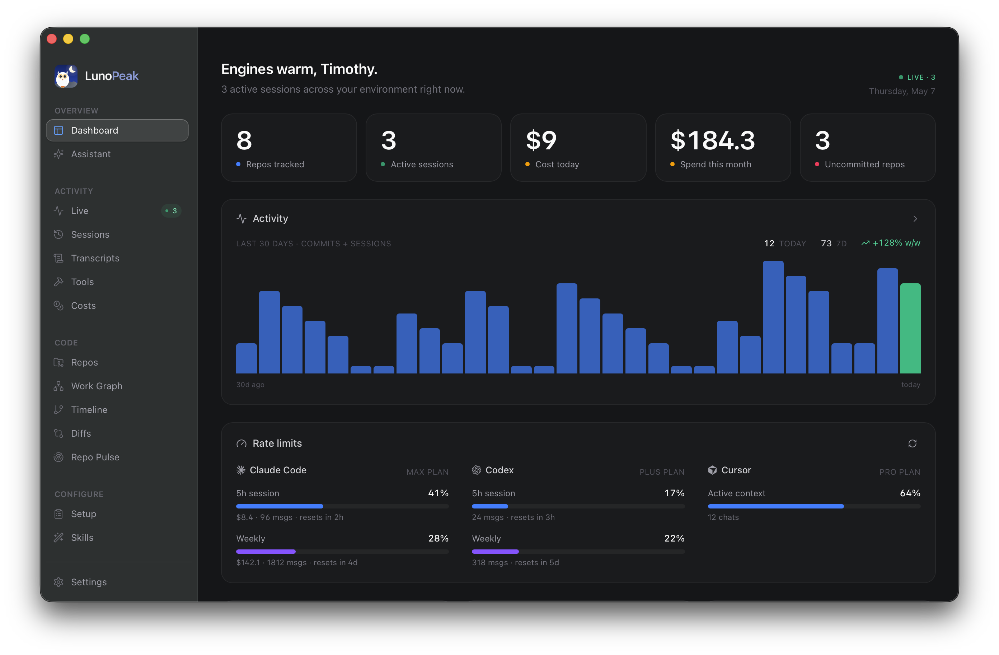
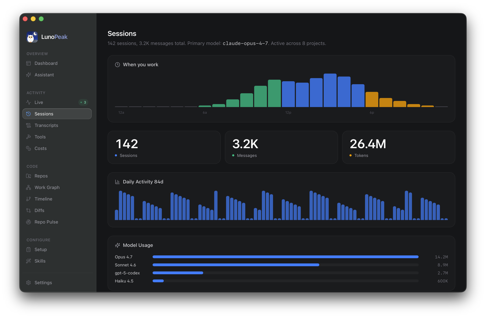
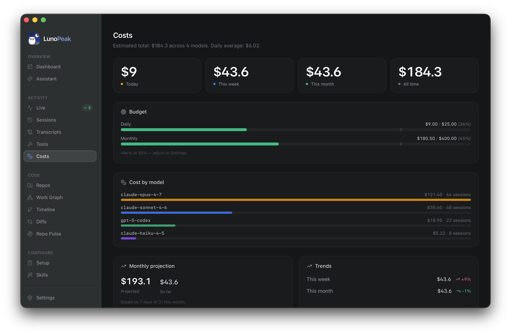
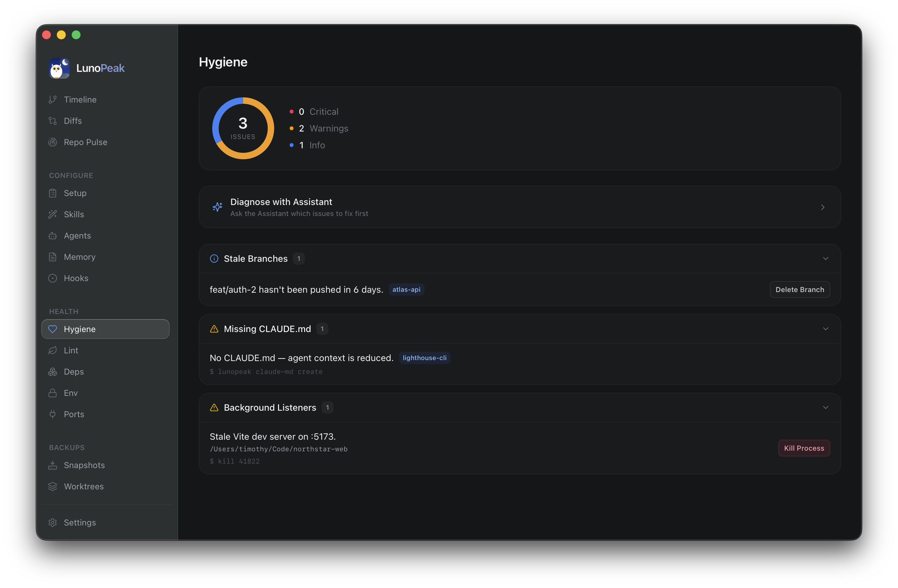

  

# LunoPeak

A local-first desktop dashboard for your AI dev environment. One window for every repo, session, agent, and config across **Claude Code, Codex, and Cursor**. No account. No cloud. No telemetry.

## Download

[**Download Latest Release**](https://github.com/idevtim/lunopeak/releases/latest)

- **macOS** — Apple Silicon & Intel
- **Windows** — x64 & ARM64
- **Linux** — AppImage (recommended), DEB, or RPM

All builds auto-update except Linux RPM (manual).

## What's New in 1.10.0

OpenAI's GPT-5.6 family — Sol, Terra, and Luna — now shows up properly in your costs, along with a handful of other models LunoPeak had been guessing at.

- **GPT-5.6 Sol, Terra, and Luna are priced correctly.** Codex sessions on a 5.6 slug were falling back to old GPT-5 rates — if you ran Sol, your spend was reported at roughly a third of the real cost. Those sessions re-price themselves the next time LunoPeak reads them; expect your Codex numbers to jump, and to be right.
- **The July 30 price cut is respected.** OpenAI dropped Terra 20% and Luna 80% on the 30th. Sessions from before that date still cost what they cost, so your history stays honest instead of being retconned to today's rates.
- **Several more models stopped being guesses.** GPT-5.4 nano, the Codex-specific models (5.3, 5.2, 5.1 Codex Max), and the Pro tiers all have their own numbers now, rather than defaulting to GPT-5.
- **The built-in assistant offers the 5.6 models.** Luna, Terra, and Sol are in the OpenAI model picker, with Sol as the new default. GPT-5.5 is still there; the 5.4 entries retire in favor of the newer, cheaper Luna and Terra.

> **Worth knowing:** OpenAI charges a premium on single prompts over 272K tokens. LunoPeak doesn't apply it — Codex only writes one running total per session, not a per-message breakdown, so there's no way to tell a genuinely huge prompt from a long conversation. Charging the premium on the total would inflate almost every long session, so a rare, very large prompt may read slightly under.

## Features

### Overview
- **Dashboard** — every active repo, session, and agent at a glance
- **Assistant** — built-in chat with full awareness of your environment
- **Tray** — provider brand marks, live usage windows, reset countdown, headline-window toggle
- **Persistent State** — window size, position, and last-viewed route remembered

### Activity & Sessions
- **Live View** — Claude Code, Codex, and Cursor sessions in real time, each process matched to its own transcript
- **Sessions History** — every past session with timing, repo, and outcomes
- **Session Replay** — step through any session turn-by-turn
- **Transcripts** — full-text searchable archive across every project
- **Tools** — which tools each session used, how often
- **Costs** — token spend per session, repo, and provider with budget alerts

### Code Intelligence
- **Repos** — every project on your machine with health and AI-usage signals
- **Repo Detail** — CLAUDE.md preview, skills, quick actions (open in Claude / VS Code / terminal, git pull)
- **Work Graph** — relationships between repos, branches, and active work
- **Timeline** — cross-repo commits, sessions, and key events
- **Diffs** — uncommitted and recent diffs across every repo
- **Repo Pulse** — activity heatmaps and rolling-window summaries

### Configuration
- **Setup** — Claude Code, Codex, and Cursor inventory: MCP servers, plugins, per-repo completeness
- **Skills** — every Claude skill, global + repo, with previews
- **Agents** — every agent definition with model, tools, and body
- **Memory** — every CLAUDE.md with topics and line counts
- **Hooks** — every configured hook, scoped per repo

### Health & Hygiene
- **Hygiene** — one-click fixes for stale branches, missing CLAUDE.md, ungitignored `.env`, uncommitted changes, and more
- **Lint** — eslint, prettier, ruff, stylelint, editorconfig across every repo
- **Deps** — manifests across npm, cargo, pip, poetry, go, bundler
- **Env** — `.env` files with key inventory, gitignore status, `.env.example` presence
- **Ports** — bound ports, owning process, working directory

### Backups
- **Snapshots** — local rollback points for project state
- **Worktrees** — manage Git worktrees from one panel

### Privacy & Security
- **Fully Local** — no account, no cloud sync, no telemetry
- **OS Keychain** — Anthropic, OpenAI, Gemini keys stored in macOS Keychain / Windows Credential Manager / Linux Secret Service
- **Auth Resilience** — Claude OAuth tokens auto-refresh across launches
- **Hardened Shell-outs** — folder paths passed as argv with per-platform quoting
- **Native Performance** — Tauri 2 (Rust). ~150 MB on disk, ~120 MB resident
- **Outbound Only When You Ask** — provider APIs only during Assistant use, plus the update endpoint

## Screenshots

### Dashboard

### Sessions

### Costs

### Hygiene

## System Requirements

| Platform | Minimum Version |
|----------|----------------|
| macOS | 10.15+ (Apple Silicon & Intel) |
| Windows | 10+ (x64 & ARM64) |
| Linux | Ubuntu 20.04+ / RHEL 8+ (x86_64 & aarch64) |

## Pricing

**Free** — personal and commercial. No paywalls, no pro tier.

## Support the Project

LunoPeak is free and will stay free. If it earns its place on your dock:

- ❤️ [**GitHub Sponsors**](https://github.com/sponsors/idevtim) — monthly support
- ☕ [**Buy Me a Coffee**](https://buymeacoffee.com/idevtim) — one-shot tip

## Links

- **Bugs** — [GitHub Issues](https://github.com/idevtim/lunopeak/issues)
- **Ideas** — [GitHub Discussions](https://github.com/idevtim/lunopeak/discussions)
- **Email** — support@lunopeak.com
- **Web** — https://lunopeak.com

---

**© 2026 LunoPeak** • Made with ❤️ for developers
