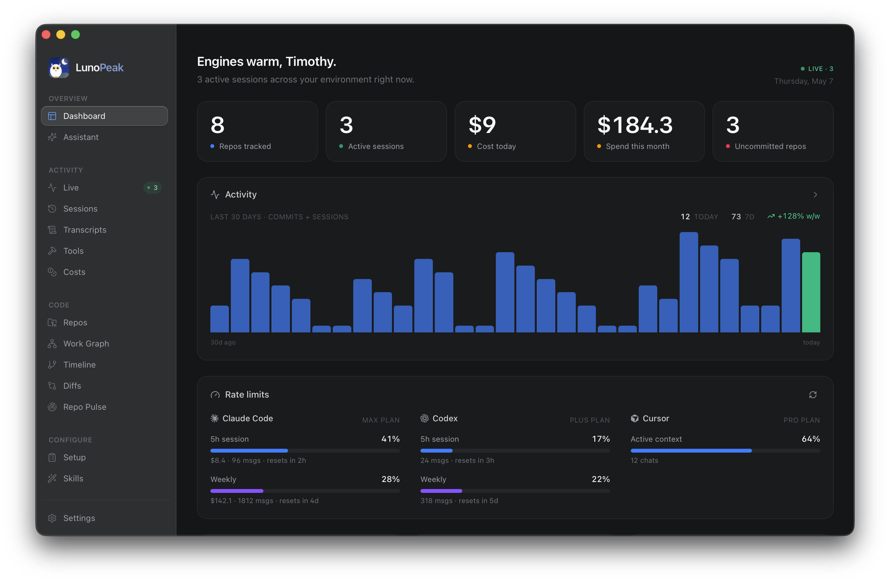
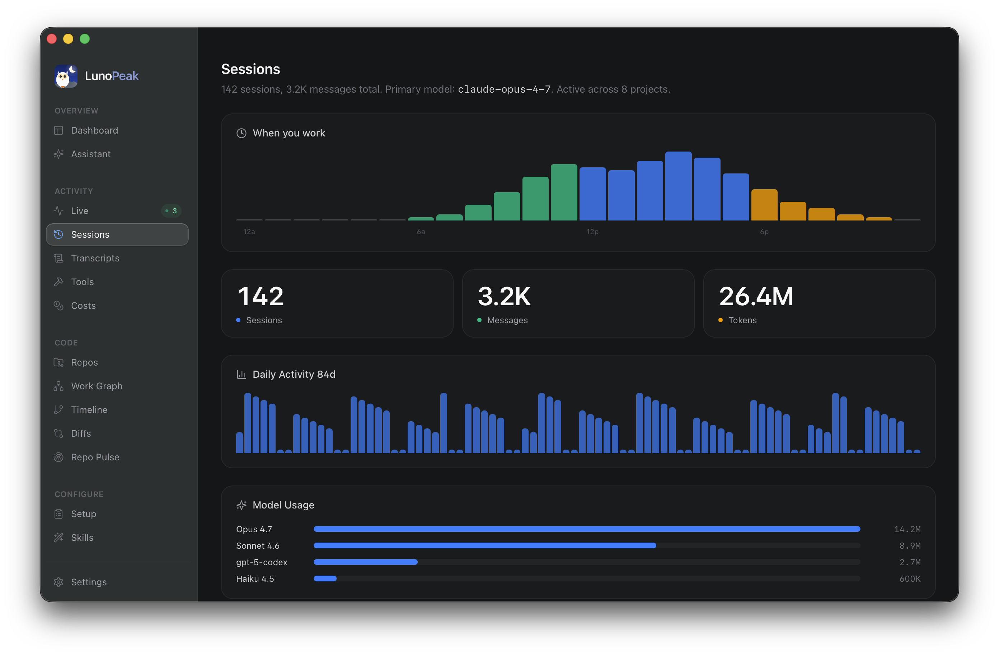
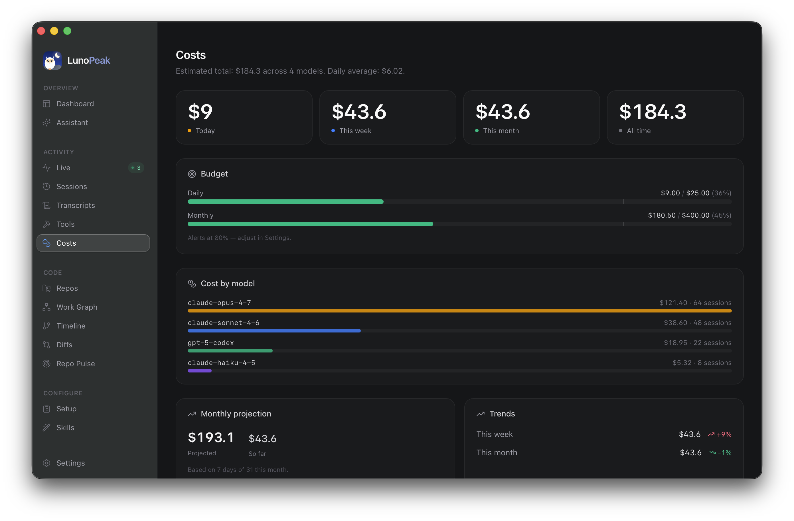
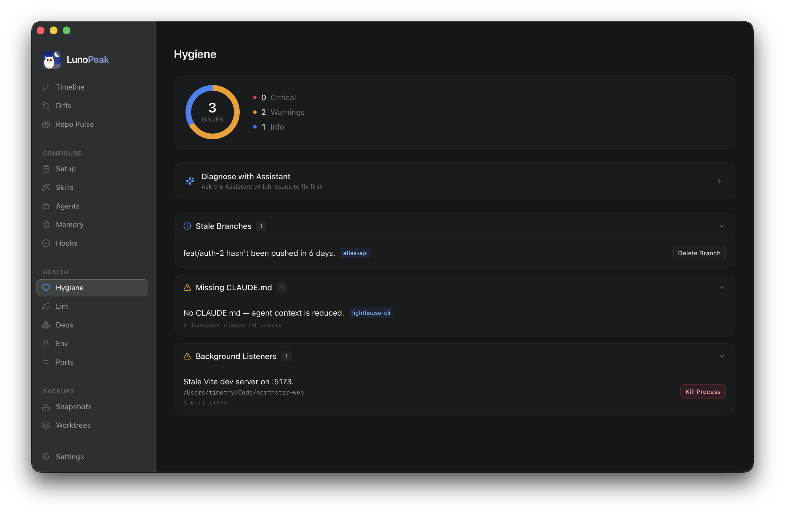

  

# LunoPeak

A local-first desktop dashboard for your AI dev environment. One window for every repo, session, agent, and config across **Claude Code, Codex, and Cursor**. No account. No cloud. No telemetry.

## Download

[**Download Latest Release**](https://github.com/idevtim/lunopeak/releases/latest)

- **macOS** — Apple Silicon & Intel
- **Windows** — x64 & ARM64
- **Linux** — AppImage (recommended), DEB, or RPM

All builds auto-update except Linux RPM (manual).

## What's New in 1.13.0

Claude Opus 5.5 gets its own price, your Fable weekly limit shows up next to the others, and the Assistant can now talk to Grok. Until now LunoPeak billed Opus 5.5 as Opus 5, so if you've been running it, your Opus 5.5 spend has been reading higher than what you actually paid.

- **Opus 5.5 is priced at its own, lower rate.** $4 per million input tokens and $20 per million output, down from Opus 5's $5 and $25, with cache writes at $5 for the 5-minute cache and $8 for the 1-hour one. LunoPeak had no idea Opus 5.5 was a separate model — it read the name as Opus 5 and charged the old rates, so input, output, and cache writes were all about a quarter too high. Those sessions re-price themselves the next time LunoPeak reads them, so expect your Opus 5.5 numbers to come down.
- **Its cheaper cache reads are counted too.** Opus 5.5 bills cached tokens at $0.20 per million — 5% of its input rate, where most models charge 10%, and less than half the $0.50 it was being charged here. On a long agentic session, where most of the bill is re-reading a prompt that's already cached, this is the line that moves most. Opus 5.5 now gets the green saving marker in Cost by model, the same one Fable 5.1 has.
- **Your Fable weekly limit has its own bar.** Claude plans cap Fable separately from the all-models weekly limit, and it often runs out first — so you could read 30% weekly and still be cut off from Fable. Rate limits on the dashboard and the menu bar panel now show a "Weekly · Fable" bar, with its percentage and reset time straight from Anthropic. It counts toward usage alerts, and the menu bar's warning banner calls it out by name when it's the closest limit to running out. To watch it from the tray, set Settings → System Tray → Headline window → Fable.
- **xAI is the Assistant's fifth provider.** Add an xAI API key in Settings → Assistant and chat with Grok 4.7, Grok 4.6, or Grok 4.5 — 4.7 is the default. Tool use works the same way it does with the other providers, so Grok can pull your costs, sessions, and repos just like Claude or GPT can. The key is stored in your system keychain, and requests go straight from your machine to xAI.
- **Opus 5.5 is in the assistant's model picker,** right after Opus 5. Sessions labels it "Opus 5.5" now as well, where it used to show up as plain "Opus 5".

> **Worth knowing:** Fast mode isn't priced separately. Opus 5.5 in fast mode bills at $8 / $40 per million, twice the standard rate, but the session logs LunoPeak reads don't say which speed a turn ran at — so every turn is charged the standard rate, and fast-mode turns will read about half what they really cost. Opus 5 in fast mode has always worked the same way. Grok is a chat provider only for now: LunoPeak doesn't track Grok spend in Costs, because none of the tools it reads usage from record Grok token counts.

## Features

### Overview
- **Dashboard** — every active repo, session, and agent at a glance
- **Assistant** — built-in chat with full awareness of your environment, across Anthropic, OpenAI, Gemini, xAI, and local Ollama models
- **Tray** — provider brand marks, live usage windows (including Claude's Fable-scoped weekly cap), reset countdown, headline-window toggle
- **Persistent State** — window size, position, and last-viewed route remembered

### Activity & Sessions
- **Live View** — Claude Code, Codex, and Cursor sessions in real time, each process matched to its own transcript
- **Sessions History** — every past session with timing, repo, and outcomes
- **Session Replay** — step through any session turn-by-turn
- **Transcripts** — full-text searchable archive across every project
- **Tools** — which tools each session used, how often
- **Costs** — token spend per session, repo, and provider with budget alerts

### Code Intelligence
- **Repos** — every project on your machine with health and AI-usage signals
- **Repo Detail** — CLAUDE.md preview, skills, quick actions (open in Claude / VS Code / terminal, git pull)
- **Work Graph** — relationships between repos, branches, and active work
- **Timeline** — cross-repo commits, sessions, and key events
- **Diffs** — uncommitted and recent diffs across every repo
- **Repo Pulse** — activity heatmaps and rolling-window summaries

### Configuration
- **Setup** — Claude Code, Codex, and Cursor inventory: MCP servers, plugins, per-repo completeness
- **Skills** — every Claude skill, global + repo, with previews
- **Agents** — every agent definition with model, tools, and body
- **Memory** — every CLAUDE.md with topics and line counts
- **Hooks** — every configured hook, scoped per repo

### Health & Hygiene
- **Hygiene** — one-click fixes for stale branches, missing CLAUDE.md, ungitignored `.env`, uncommitted changes, and more
- **Lint** — eslint, prettier, ruff, stylelint, editorconfig across every repo
- **Deps** — manifests across npm, cargo, pip, poetry, go, bundler
- **Env** — `.env` files with key inventory, gitignore status, `.env.example` presence
- **Ports** — bound ports, owning process, working directory

### Backups
- **Snapshots** — local rollback points for project state
- **Worktrees** — manage Git worktrees from one panel

### Privacy & Security
- **Fully Local** — no account, no cloud sync, no telemetry
- **OS Keychain** — Anthropic, OpenAI, Gemini, and xAI keys stored in macOS Keychain / Windows Credential Manager / Linux Secret Service
- **Auth Resilience** — Claude OAuth tokens auto-refresh across launches
- **Hardened Shell-outs** — folder paths passed as argv with per-platform quoting
- **Native Performance** — Tauri 2 (Rust). ~150 MB on disk, ~120 MB resident
- **Outbound Only When You Ask** — provider APIs only during Assistant use, plus the update endpoint

## Screenshots

### Dashboard

### Sessions

### Costs

### Hygiene

## System Requirements

| Platform | Minimum Version |
|----------|----------------|
| macOS | 10.15+ (Apple Silicon & Intel) |
| Windows | 10+ (x64 & ARM64) |
| Linux | Ubuntu 20.04+ / RHEL 8+ (x86_64 & aarch64) |

## Pricing

**Free** — personal and commercial. No paywalls, no pro tier.

## Support the Project

LunoPeak is free and will stay free. If it earns its place on your dock:

- ❤️ [**GitHub Sponsors**](https://github.com/sponsors/idevtim) — monthly support
- ☕ [**Buy Me a Coffee**](https://buymeacoffee.com/idevtim) — one-shot tip

## Links

- **Bugs** — [GitHub Issues](https://github.com/idevtim/lunopeak/issues)
- **Ideas** — [GitHub Discussions](https://github.com/idevtim/lunopeak/discussions)
- **Email** — support@lunopeak.com
- **Web** — https://lunopeak.com

---

**© 2026 LunoPeak** • Made with ❤️ for developers
